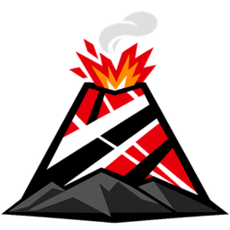

<p align="center">
  
</p>

<h1 align="center">Eruption Engine</h1>

<p align="center">
  <a href="README.md">English</a> · <a href="README.pt-BR.md">Português</a> · <b>日本語</b>
</p>

<p align="center">
  ジオラマ風の世界を描くためのレンダリングエンジン。C++17 と Vulkan 1.3 で書かれています。
</p>

<p align="center">
  <a href="LICENSE"></a>
  
  
</p>

## 概要

Eruption Engine は、ジオラマ風の見た目で 3D シーンを描画します。傾いたカメラ、ミニチュア風の被写界深度、3D ジオメトリと共存する 2D スプライト、そして物理ベースのライティングが特徴です。中間レイヤーを挟まず、純粋な C++17 で Vulkan 1.3 を直接扱っています。古い内蔵 GPU から最新のグラフィックスカードまで快適に動作することを目標とし、機能をオフにするのではなく、パラメータで品質を段階的に調整します。

## 主な機能

- **Vulkan 1.3 バックエンド**：`dynamic_rendering`、`synchronization2`、descriptor indexing によるバインドレステクスチャ。
- **ディファードシェーディング**：5 つのアタッチメントを持つ G-buffer と、数百の動的ライト。
- **物理ベースのライティング**：エネルギー補償付き Cook-Torrance、IBL、イラディアンスプローブ、ロード時にアルベドから PBR マップを生成。
- **シャドウ**：太陽光にはカスケードシャドウマップ、点光源にはキューブマップ。シャドウ用の LOD はメッシュの LOD から独立しています。
- **天候と大気**：40 種類以上の天候、ジオメトリで遮蔽される雨と雪、濡れた路面、霧、昼夜サイクル、ボリュメトリッククラウド。
- **水面**：ゲルストナー波、反射と屈折。
- **ポストプロセス**：物理的な錯乱円によるティルトシフト、ブルーム、ゴッドレイ、AgX / ACES トーンマッピング、アップスケール付き FXAA。
- **地形とモデル**：セル単位の地形メッシュとマテリアルブレンド、メッシュと植生の LOD を備えた glTF モデル、インスタンシング。
- **2D スプライト**：実行時に生成されるノーマルマップ、平面シャドウ、ディファードパイプラインへの完全な統合。
- **CSS で記述する HUD**：ウィジェットのレイアウトは `data/hud/default.css` に記述し、保存すると即座に反映されます。ビジュアルエディタ（Caldera）付き。
- **ツール**：HUD ビジュアルエディタ（Caldera）、PBR クッカー、ノーマルマップ生成。

## ビルド

必要なもの：

- C++17 コンパイラ（GCC 13 以上、Clang 16 以上、または MSVC 2022 以上）
- CMake 3.28 以上
- Vulkan SDK 1.3 以上
- GLFW 3.3 以上、zlib、iconv
- Debug ビルドの場合：Vulkan バリデーションレイヤー（`vulkan-validationlayers`）

その他の依存ライブラリ（GLM、VMA、shaderc、Dear ImGui、nlohmann/json、tinygltf、Draco、bc7enc）は CMake が自動で取得します。

```bash
git clone --recurse-submodules https://github.com/eruptionlabs/eruption-engine.git
cd eruption-engine
./build_and_run.sh          # 最適化ビルドして実行
./build.sh                  # Vulkan バリデーション付きの Debug ビルド
```

特定のマップで起動するには：

```bash
./launch.sh --map parana_field
```

デモマップ `parana_field` は CC0 テクスチャのみを使用しています。`.glb` ファイルは GitHub のファイルサイズ上限を超えるため、リリースアセットとして配布しています。初回の CMake 構成時に自動でダウンロード（約 170 MB）し、チェックサムを検証します。手動で取得する場合は `tools/fetch_demo_map.sh` を実行し、取得しない場合は `-DERUPTION_FETCH_DEMO_MAP=OFF` を指定してください。初回ロード時に、エンジンが埋め込みテクスチャを圧縮し、その結果をマップの隣にキャッシュします。

## ディレクトリ構成

| フォルダ | 内容 |
|---|---|
| `src/` | エンジン本体：レンダラー、ファイル形式、天候、カメラ、HUD |
| `shaders/` | GLSL（ビルド時に SPIR-V へコンパイル） |
| `assets/` | アイコン、サンプルスプライト、デモマップ |
| `data/` | グラフィックス、天候、水面、シャドウの設定 |
| `tools/` | PBR クッカー、ノーマルマップ生成、ビルド用スクリプト |
| `tools/caldera/` | HUD ビジュアルエディタ Caldera（サブモジュール） |
| `tests/` | ユニットテストと回帰テスト |

## 関連リポジトリ

- [caldera](https://github.com/eruptionlabs/caldera)：HUD ビジュアルエディタ。

## コントリビュート

プルリクエストを送る前に [CONTRIBUTING.md](CONTRIBUTING.md) をお読みください。コードの貢献は Apache License 2.0 のもとで受け付けます。第三者の権利を含むアセット、モデル、テクスチャ、マップは受け付けていません。

## ライセンス

ソースコードは [Apache License 2.0](LICENSE) で公開しています。サードパーティライブラリとそのライセンスは [NOTICE](NOTICE) に記載しています。`assets/` 内のアセットはそれぞれのライセンスに従い、コードのライセンスの対象外です。

「Eruption Engine」とそのロゴは Gdg Soluções Digitais LTDA の商標です。コードのライセンスは商標の使用権を与えるものではありません。
